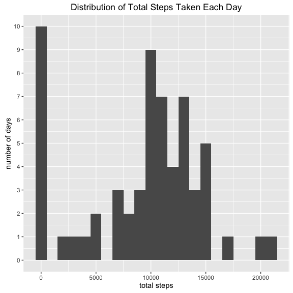
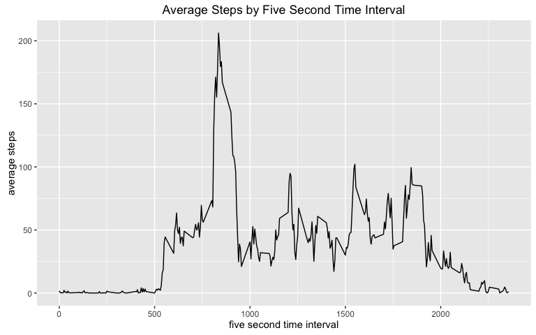
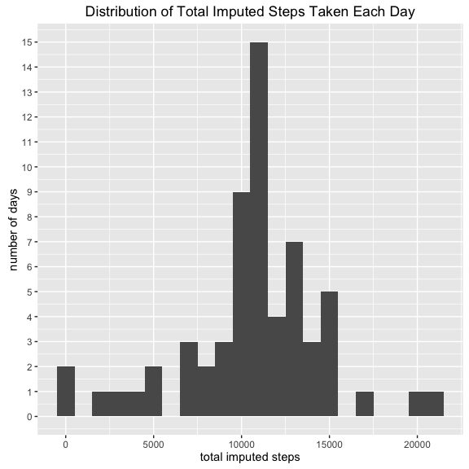
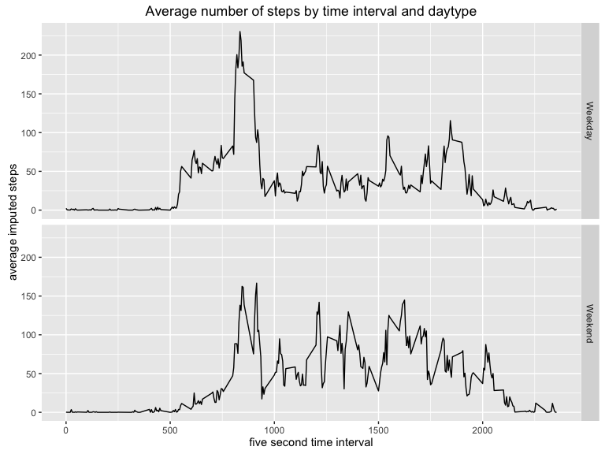

# Reproducible Research: Peer Assessment 1
Max Lyons  
6/26/2016  
Load ggplot2 for plotting, and dplyr for data wrangling

```r
library(ggplot2)
```

```
## Warning: package 'ggplot2' was built under R version 3.1.3
```

```r
library(dplyr)
```

```
## Warning: package 'dplyr' was built under R version 3.1.3
```

```
## 
## Attaching package: 'dplyr'
## 
## The following objects are masked from 'package:stats':
## 
##     filter, lag
## 
## The following objects are masked from 'package:base':
## 
##     intersect, setdiff, setequal, union
```

## Loading and preprocessing the data
First we will unzip the wearable technology data and load it into R

```r
unzip("activity.zip")
activity <- read.csv("activity.csv",header=T,stringsAsFactors = FALSE)
head(activity)
```

```
##   steps       date interval
## 1    NA 2012-10-01        0
## 2    NA 2012-10-01        5
## 3    NA 2012-10-01       10
## 4    NA 2012-10-01       15
## 5    NA 2012-10-01       20
## 6    NA 2012-10-01       25
```

## What is mean total number of steps taken per day?
To find the mean number of steps taken each day, we first need to create a 
dataframe of steps by day

```r
day_activity <- activity %>% group_by(date) %>% 
    summarise(steps = sum(steps, na.rm = TRUE))
```
We can then make a histogram of total steps taken each day

```r
steps_hist <- ggplot(day_activity, aes(x = steps)) + 
    geom_histogram(binwidth = 1000)
steps_hist <- steps_hist + scale_y_continuous("number of days",breaks=0:10)
steps_hist <- steps_hist + 
    labs(title = "Distribution of Total Steps Taken Each Day", x="total steps")
steps_hist
```

 
  
And use the same dataframe to calculate the mean and median of total steps

```r
mean(day_activity$steps)
```

```
## [1] 9354.23
```

```r
median(day_activity$steps)
```

```
## [1] 10395
```

## What is the average daily activity pattern?
To make a time series plot of the average number of steps taken across each 5
second time interval, we first need to create a dataframe of average steps
by time interval

```r
interval_activity <- activity %>% group_by(interval) %>%
    summarise(average_steps = mean(steps, na.rm = TRUE))
```
And then plot the time series:

```r
steps_ts <- ggplot(interval_activity, aes(x = interval, y = average_steps)) + 
    geom_line()
steps_ts <- steps_ts + labs(title="Average Steps by Five Second Time Interval",
                            x = "five second time interval",
                            y = "average steps")
steps_ts
```

 
  
From the plot we can see that the interval with the highest average number of
steps is around 800, and we can use the dataframe to confirm:

```r
highest_average_interval <- interval_activity %>% top_n(1,average_steps)
highest_average_interval
```

```
## Source: local data frame [1 x 2]
## 
##   interval average_steps
##      (int)         (dbl)
## 1      835      206.1698
```
The time interval at 835 seconds has the 
highest average number of steps at 206.1698113

## Imputing missing values
Calculate the total number of records with missing values:

```r
missing_intervals <- activity %>% filter(is.na(steps))
missing_intervals_num <- nrow(missing_intervals)
missing_intervals_num
```

```
## [1] 2304
```
The total number of intervals with missing step values is 
2304

We can then impute values for any missing time interval by using the average 
number of steps during that same time interval over all days

```r
imputed_activity <- activity %>% left_join(interval_activity) %>%
    mutate(imputed_steps = ifelse(is.na(steps),average_steps,steps)) %>%
    select(imputed_steps, date, interval)
```

```
## Joining by: "interval"
```

```r
head(imputed_activity)
```

```
##   imputed_steps       date interval
## 1     1.7169811 2012-10-01        0
## 2     0.3396226 2012-10-01        5
## 3     0.1320755 2012-10-01       10
## 4     0.1509434 2012-10-01       15
## 5     0.0754717 2012-10-01       20
## 6     2.0943396 2012-10-01       25
```
To make a histogram of total number of imputed steps by day, we will 
make a similar dataframe as we made above, just with our imputed step data

```r
imputed_day_activity <- imputed_activity %>% group_by(date) %>% 
    summarise(imputed_steps = sum(imputed_steps, na.rm = TRUE))
```
We can then make a histogram of total imputed steps taken each day

```r
imp_steps_hist <- ggplot(imputed_day_activity, aes(x = imputed_steps)) + 
    geom_histogram(binwidth = 1000)
imp_steps_hist <- imp_steps_hist + 
    scale_y_continuous("number of days",breaks=0:15)
imp_steps_hist <- imp_steps_hist + 
    labs(title = "Distribution of Total Imputed Steps Taken Each Day", 
         x="total imputed steps")
imp_steps_hist
```

 
  
And use the same dataframe to calculate the mean and median of 
total imputed steps

```r
mean(imputed_day_activity$imputed_steps)
```

```
## [1] 10766.19
```

```r
median(imputed_day_activity$imputed_steps)
```

```
## [1] 10766.19
```
We can see that both the histogram and the mean/median are different from the
calculations above because by simply replacing missing data with the average
number of steps over that same time interval we make the data that appeared 
most frequently in the original data set to appear even more frequently.

## Are there differences in activity patterns between weekdays and weekends?
To find differences in activity patterns between weekdays and weekends we must
first determine which days fit into each group:

```r
daytype_activity <- imputed_activity %>% 
    mutate(dayofweek = weekdays(as.Date(date)),
           daytype = factor(ifelse(dayofweek %in% c("Saturday","Sunday"),
                                   "Weekend","Weekday"))) 
```
Let's first calculate the average number of steps by daytype and interval

```r
daytype_avg_activity <- daytype_activity %>% group_by(daytype,interval) %>%
    summarise(average_steps = mean(imputed_steps))
```
And then use this dataframe to make a time series plot by interval of the
average number of imputed steps:

```r
day_plot <- ggplot(daytype_avg_activity, aes(x = interval, y = average_steps)) + 
    geom_line()
day_plot <- day_plot + facet_grid(daytype ~ .)
day_plot <- day_plot + labs(title = 
                    "Average number of steps by time interval and daytype",
                    x = "five second time interval",
                    y = "average imputed steps")
day_plot
```

 
  
We can see from this plot that there are indeed differences between the average
number of steps taken on weekdays and weekends. Two things of note would be that
the bulk of steps start later in the day on weekends, and there are multiple 
similar peaks through weekend days compared to one initial early peak on 
weekdays.

